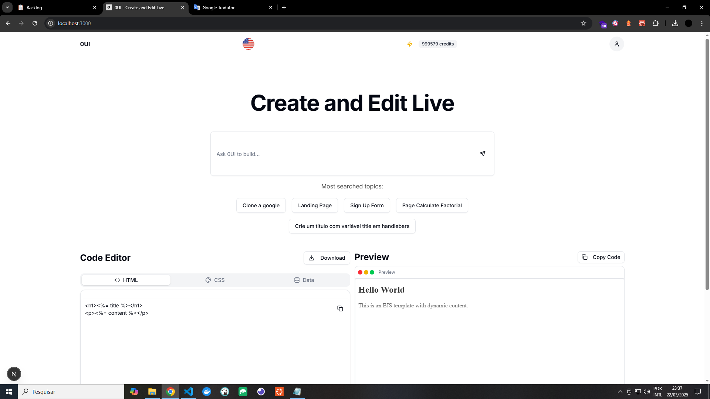

[](https://twitter.com/t_h_e_u)
[](https://www.linkedin.com/in/matheusgbatista/)
[](https://t-heu.github.io)

## Getting Started

First, run command:

```bash
npm install
```

Second, run the development server:

```bash
npm run dev
```

Open [http://localhost:3000](http://localhost:3000) with your browser to see the result.

**OBS.:** configure your `.env.local` file

## Learn More

A powerful tool for developers who want to quickly generate pages using EJS and pure CSS (or lightweight frameworks) without having to write the code manually. The difference here is the integration with EJS, allowing dynamic customization on the pages and the possibility of exporting the code ready for use.

## 🖼️ Preview


